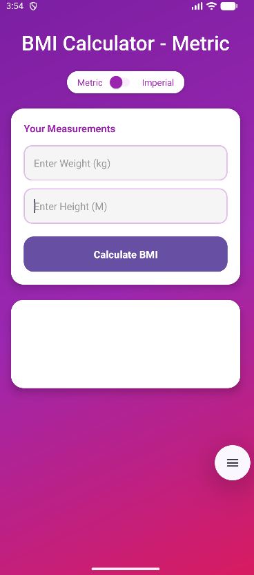
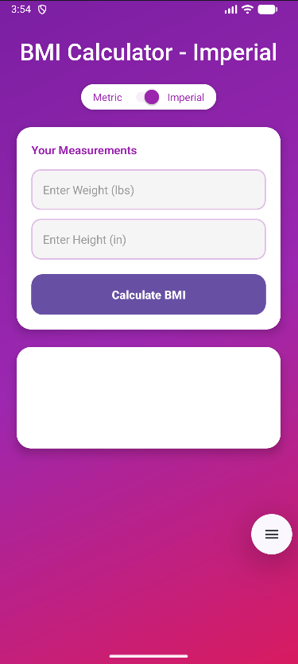
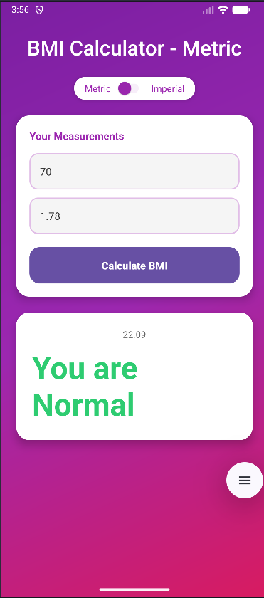

⚖️ BMI Calculator – Android App

A sleek and intuitive BMI (Body Mass Index) calculator built using Java and Android Studio, designed with a modern UI, smooth UX, and support for both Metric and Imperial units.

The app focuses on simplicity — quick input, clear results, and clean visuals.

✨ Features

🔹 BMI calculation using Metric (kg / cm)
🔹 BMI calculation using Imperial (lbs / ft & in)
🔹 Instant result with BMI category indicator
🔹 Modern and minimal UI design
🔹 Auto-formatted input for smoother data entry
🔹 Color-coded result feedback (Underweight / Normal / Overweight / Obese)

🎨 User Experience

The UI is designed to feel effortless:

Large input fields for easy typing

Soft color palette that adapts to BMI category

Clear fonts and spacing for readability

Single-screen flow — no unnecessary navigation

🛠 Tech Stack
Layer	Technology
Language	Java
UI	XML Layouts
Architecture	Activity-based
Build System	Gradle
Version Control	Git & GitHub
📸 Screenshots
Metric Mode	Imperial Mode	Result Screen
		

Place screenshots inside /screenshots and update the image names if needed.

📥 Download APK

🔗 Download Latest Release

Works on Android 7.0 (Nougat) and above.

🚀 Roadmap

Health tips based on BMI category

BMI history tracking

Recommended calorie range

Age-based BMI interpretation

🧾 License

Open-source under the MIT License.
Feel free to use, modify, or improve the project.

👨‍💻 Developer

Jasdeep Singh — Android Developer (Java/Kotlin)
Exploring Android UI/UX and building real projects to strengthen development skills.

If you like this project, please ⭐ star the repo — it motivates future updates!
